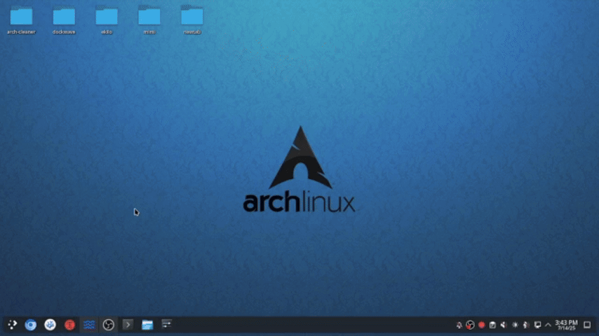

# Dockwave - Docker Management System

[](https://opensource.org/licenses/MIT)

A lightweight Docker management interface with Docker Hub integration, built with React + TypeScript and Node.js.



## Features

- **Containers**: Start,stop,restart & remove containers.
- **Images**: List & remove images.
- **DockerHub**: Search & download images.
- **Networks**: List networks.
- **Volumes**: List volumes.

## Tech Stack

**Frontend**
- React 18 + TypeScript.
- Tailwind CSS + Shadcn/UI.
- Vite, React Query, Socket.IO.

**Backend**
- Node.js/Express.
- Dockerode, Redis, JWT.

## Quick Start

### Docker Compose (Recommended)
```bash
git clone https://github.com/antonio-foti/dockwave.git
cd dockwave
docker-compose up -d
```

### Access:
```bash
Web UI: http://localhost:8080
```

## Contribution

Contributions are welcome! Please:

- Open an issue to discuss proposed changes
- Submit pull requests with clear descriptions
- Maintain consistent coding style
- Update documentation (README.md) for new features

## License

MIT License - Free to use and modify

Created by Antonio Foti
